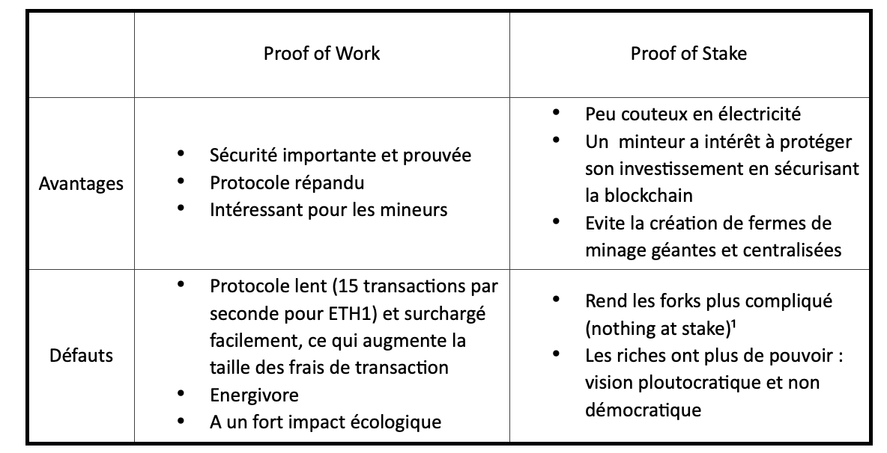

# ETH 2.0

**Introduction**

Ethereum a subit de nombreuses critiques ces dernières années, notamment concernant l’explosion des frais de transactions. Ceci ralentit considerablment l’expansion du réseau ETH. C’est pourquoi une nouvelle version d’Ethereum est en train d’être développé depuis quelques années.

Nous allons dans cet article revoir grossièrement les changements qu’apporte Ethereum 2.0 afin de comprendre les enjeux de cette transition.

**Proof of Work VS Proof of Stake**

La validation des transactions est faite sur la blockchain Ethereum 1.0 grâce à une preuve de travail. Pour valider un bloc, un calcul cryptographique est réalisé. Le premier ordinateur qui réalise le calcul (aka qui mine le block) reçois une récompense. Ainsi, lors d’un protocole Proof of Work (PoW), la puissance de calcul est récompensée. Cependant, plus de puissance de calcul ne signifie pas plus de blocs. Plus de blocs signifie une blockchain plus lourde et donc plus difficile à supporter par tout le monde. Pour la même raison, la taille du bloc (aka le nombre de transaction pouvant être inscrit dans le bloc) est fixe. Concrètement, la fréquence d’apparition du block est déterminée par la difficulté du problème cryptographique, qui elle est variable et est déterminée par la puissance totale dédiée au réseau. La contrepartie de ce principe est que le nombre maximal de transaction est lui aussi fixé. Si le nombre total de transaction dépasse le nombre de transaction réalisable sur la blockchain (la demande est supérieure à l’offre maximale) alors les transactions devront être accompagnée de frais de transaction (gas dans le cas ETH). Plus le gas est élevé, plus la transaction sera effectué rapidement.

Ethereum subit actuellement une explosion de ses frais de transaction, ce qui décourage les personnes à effectuer des transactions sur le réseau. Ceci n’est pas viable sur le long terme pour ETH.

De plus, la preuve d’enjeu est néfaste pour l’environnement.

Comme expliqué plus haut, la preuve d’enjeu est une compétition à la puissance de calcul. Or qui dit puissance de calcul dit consommation d’électricité. Cette consommation n’est d’une part pas éco-responsable, et d’autre part génère des coûts importants pour les mineurs et donc pour le maintien du réseau.

Ethereum a donc pris la décision de changer de méthode de vérification de bloc et est passé de la preuve de travail à la preuve d’enjeu (Proof of Stake / PoS)

Le protocole PoS ne valide plus les blocs en réalisant un problème cryptographique, mais en votant. Chaque vote est associé à un montant de cryptomonnaie détenu. Plus le montant est élevé, plus le vote a d’importance. Cette validation est basée sur une incitation financière. D’une part, la personne qui valide un bloc reçois des intérêts dans la monnaie en question. D’autre part, plus le montant de cryptomonnaie mis en jeu est élevé, moins la personne a d’intérêt à truquer la blockchain en inserant de fausse transaction, car ceci détruirait la crédibilité de la blockchain et donc l’investissement mis en jeu.

¹Un fork est une division de la blockchain en 2 blockchain différentes. Dans le cas d’une PoW, un mineur a intérêt à choisir la blockchain qu’il veut miner afin d’avoir plus de chance de miner le bloc. Cependant, dans le cas d’une PoS, un minteur (personnes votant sur un blockchain Proof of Stake) pourrait très bien voter sur 2 blockchain et donc récupérer plus de gains que si elle ne votait sur une seule chaine. Afin d’éviter que des minteurs ne votent sur 2 chaines différentes, Ethereum a mis en place le Slashing. Ceci consiste simplement en une pénalisation financière des minteurs votant sur 2 chaines différentes.

L’implémentation d’une blockchain PoS est surement LA différence entre Ethereum 1.0 et Ethereum 2.0 cependant il y a d’autres modifications apportées par ETH 2

**Sharding**

Ethereum 2.0 ne sera pas en réalité qu’une seule blockchain, mais 64 blockchains. Elles seront reliées entre elles grâce à la Beacon Chain. Une augmentation du nombre de chaines permet d’augmenter le nombre de transactions réalisables en Ethereum, tout en réduisant la taille de chaque chaine, la rendant donc plus légère, et donc plus accessible à tous.

**Burn**

Ethereum 2.0 comportera 2 types de frais :

Une première partie sera destinée aux minteurs comme récompense, tandis qu’une autre partie sera détruite (burn)

Cette destruction d’ETH réduira considérablement le nombre d’Ethereum en circulation. Aujourd’hui la production est d’environ 4.7 millions d’Ethereum par an. Cette production sera réduite à 2 millions d’Ethereum si la totalité des ETH sont utilisés pour vérifier les transactions. C’est donc une borne supérieure qui ne sera probablement pas approché.

**Timeline ETHEREUM 2.0**

**4 novembre 2020 : Phase 0**

Création de la beacon chain : chaine principale qui servira de transition entre toute les shards (sous chaines d’ethereum)

La production des blocs commencera quand il y aura assez d’ethereum mis en jeu sur cette chaine. Ethereum a fixé cette limite à 16 384 utilisateurs et 524 288 ETH. La productio de bloc pour ETH 2.0 a commencé le 1er décembre 2020

But de la beacon chain : tester et commencer le minage de block en PoS.

**2021 : Phase 1**

La Phase 1 de la mise en place d’ETH 2.0 sera mise en place courant 2021 et consistera en l’élaboration des shards d’eth

Ces sous chaines seront inutiles pour l’instant mais permettront de mettre en place le réseaude chaine.

**Horizon 2021/2022 : Phase 2 :**

The Docker : Intégration de ETH 1 dans la nouvelle blockchain ETH 2

Ethereum 1 sera integré en tant que shard d’Ethereum 2 et changera son protocole de PoW a PoS

Les shards integreront aussi les smart contracts et les transferts à partir de cette date. Avant ceci les shards n’avaient pas de fonctionnalités particulières.
