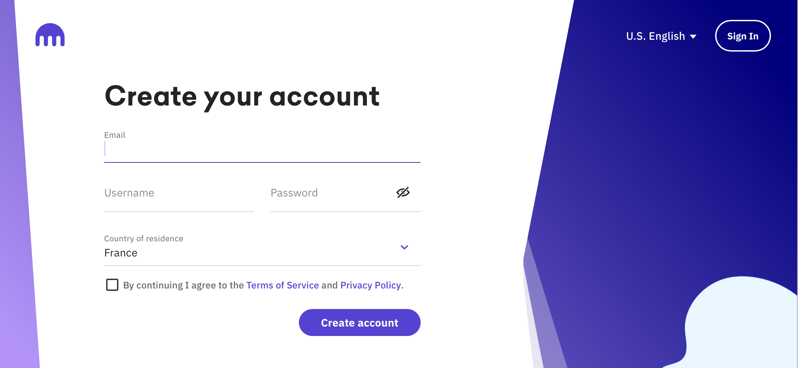

# Binance

## Introduction

Binance est une plateforme d’échange, créer en juillet 2017 par Changpang Zhao. Basée à Honk Kong, cette plateforme propose d’échanger plus de 100 cryptomonnaies. Début 2018, elle connaît un essor énorme et se place parmi les meilleurs plateforme d’achat et d’échange de cryptomonnaie. Le nom Binance vient de Binary (binaire) et finance. Binance est donc une plateforme qui permet d’acheter, stocker, revendre ou encore échanger des cryptomonnaie. Depuis près de 2 ans Binance permet d’acheter des cryptomonnaies directement avec une carte bancaire. Les frais de transaction de Binance font partie des plus bas du marché, cela justifie l’engouement qu’a connu la plateforme dès ses débuts. La taxe est égale à 0,1% par montant retiré ou échangé. En 2018 Bloomberg a communiqué que le siège social de Binance pouvez se trouver à Malte.

## Création d'un compte Binance

S’inscrire sur Binance est assez simple, ils suffit de rentrer un e-mail ( de préférence dédié à la plateforme), choisir un mot de passe et confirmez d’être âgée de plus de 18 ans. Ensuite il faut appuyer sur « créer un compte » et tout est fait. Un test pour vérifier que vous n’êtes pas un robot va vous être proposé. Par la suite vous recevrez un code de vérification par e-mail, qu’il vous faudra rentrer afin de valider votre compte. Une fois votre adresse mail vérifiez vous pouvez accéder à l’interface Binance.

## Vérification de compte

Faire vérifier son compte sur Binance permet d’augmenter le plafond quotidien de retrait. Au premier niveau, lorsque vous arrivez, il est possible de retirer 2 BTC toute les 24 heures. Après avoir procéder à la vérification du compte, vous intégrez le niveau 2 qui vous permet d’aller jusqu’à 100 BTC toute les 24 heures. Cependant, la vérification du compte reste facultative, chacun est libre d’utiliser la plateforme avec ou sans vérification de compte.

Si vous souhaitez faire vérifier votre compte, il faudra vous rendre sur l’onglet « sécurité » puis appuyer sur « vérifier ». A la suite une fenêtre va s’ouvrir, vous devez cliquez sur « personnel ». Une nouvelle page va vous être proposé, on vous demandera de renseigner vos informations personnelles( nom, prénom, date de naissance, adresse, code postal…). Après avoir remplis, vous cliquerez sur « commencer la vérification », puis cliquez sur « verify ID& face ».

Préparer le document d’identité de votre choix( parmi ceux autorisés), puis appuyer sur le bouton « start ». Suivez les indications, selon ce que vous avez choisi.

Vous pouvez scanner vos documents personnelles avec une webcam, si vous n’en avez pas vous pouvez utiliser l’option « switch to mobile » et scanner un QR code. Les documents doivent lisibles et clairs.

## Transfert de fond

Connectez-vous à votre compte Binance et cliquez sur « Portefeuille » dans le centre utilisateur. Cliquez sur l’option « Portefeuille Margin » et ensuite sélectionnez la crypto dans laquelle vous souhaitez effectuer la transaction. ensuite appuyez sur « Transfert » et confirmer la transaction de Portefeuille Spot au Portefeuille sur Marge. Le montant souhaitez est à rentrer aussi. Une fois le transfert accompli, vous pourrez voir le solde sur votre compte mis à jour.

## Achat simple

À la différence des autres plateforme, Binance permet à ses utilisateurs d’acheter de la cryptomonnaie directement avec une carte de crédit ou un virement. Il suffit de se rendre dans l’onglet en haut à gauche « acheter des crypto ». Plusieurs variétés de cryptomonnaies sont accessibles, parmi elles on retrouve : BTC, BNB, ETH, NANO, USDT…

Lors d’un achat, vous devez choisir la cryptomonnaie et le montant de votre choix. Le moyen du paiement est aussi à faire : Bank Card( carte bancaire), other paiements ( virement). Le nombre de BTC que vous obtiendrez est affiché à l’écran.

Attention, il existe une différence de frais entre le paiement par carte et celui par virement. En effet, le paiement par carte bancaire est plus coûteux.

Achat par carte bancaire :

Dès lors que vous avez fait votre choix, cliquez sur **Acheter BTC**. Puis, comme l’achat de vêtement en ligne, il vous suffit de rentrer vos coordonnées bancaires.

Une fois que votre carte est enregistrer, appuyez sur Buy Crypto. Remettez, à nouveau les valeurs choisis pour votre achat, puis comme précédemment, cliquez sur **Acheter BTC**. Avant de finaliser, l’achat Binance vous demandera des informations complémentaires ( nationalité, montant de l’investissement…). Puis appuyer sur confirmer.

Achat par virement :

L’achat par virement bancaire, est plus intéressant pour éviter un maximum les frais qui accompagnes les échanges ou encore les achats. Il est donc préférable de passer par un virement SEPA, cependant ce mode de paiement peut prendre 24 à 48 heures ce qui enlève le caractère rapide d’un achat de crypto.

Pour acheter par exemple du Bitcoin, via un virement, vous devez cliquez sur le bouton « acheter de la crypto » qui se trouve en haut à gauche du site web, puis sur « dépôt bancaire ».

Binance vous communique les informations bancaires de son partenaires, essentiels à l’envoie du virement.

De votre côté, il vous faudra ajouter un nouveau bénéficiaire via l’application de votre banque. Puis vous procéderez au virement avec le montant définis.

⚠️ Un numéro de référence va vous être donné, il est important car il permet à la plateforme de lier la transaction à votre compte. Il doit être communiqué lors de votre virement. Si vous oubliez de le renseigner lors d’un transfert vos fonds ne pourront pas être crédités.

Dès lors, les fonds crédités sur votre portefeuille Binance, vous pouvez acheter toute sorte de cryptomonnaie disponible sur la plateforme. Pour cela, il vous suffit de cliquer sur « acheter des cryptos » puis sur « solde en cash ». Vous sélectionnez la cryptomonnaie que vous souhaitez puis vous appuyez sur « acheter BTC ». Vous voilà détenteur de crypto !

## Sécuriser son compte

Afin de sécuriser votre compte Binance , dès votre inscription, il est recommandé d’effectuer une double authentification (Two-factor Authentification ou 2FA). C’est en effet une couche de sécurité supplémentaire à votre compte qui regroupe ce que vous connaissez (votre mot de passe) et ce que vous possédez (un smartphone). Cette étape n’est pas obligatoire, mais fortement recommandée.

Pour activer ou désactivé cette 2FA, cliquez sur l’icône « settings».

Ensuite cliquez sur l’onglet « sécurité » situé sur la colonne de gauche. Il vous sera proposé de choisir une méthode d’authentification: soit un mot de passe statique (fortement déconseillé), soit l’application « Google Authentificator », soit encore l’appareil d’authentification Yubikey. Le plus pratique à utiliser est l’application mobile Google.

.png>)

Tout d’abord télécharger l’appli « google Authentificator », disponible sur androïd et apple.

.png>)

Votre QR code et votre clé d’authentification vont apparaître à l’écran gardez les . Il est important de garder cette clé précieusement écrite sur une feuille ou autre, car c’est elle qui en cas de perte de téléphone par exemple va vous permettre de récupérer votre compte.

.png>)

Ensuite, rendez-vous sur l’application Google Authentificator. On vous proposera de configurer votre compte de deux manières : par QR code ou en saisissant votre clé manuellement. Pour notre exemple nous allons choisir la seconde méthode. Il faut donc saisir les informations demandées, puis un mot de passe à 6 chiffres se génère automatiquement en changeant toute les 30 secondes.

Pour finir un code vérification, envoyé par email, et le code vérification de google authentificator sont à rentrer. Une fois fait votre compte sera sécurisé.

.png>)
